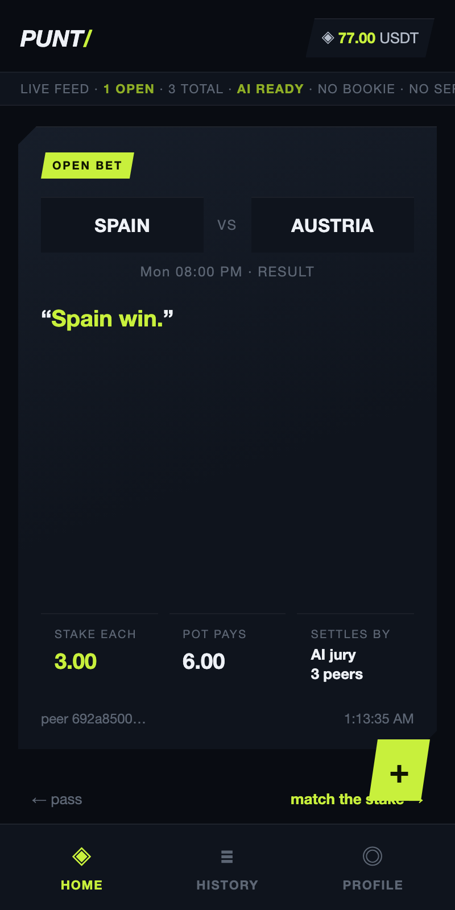
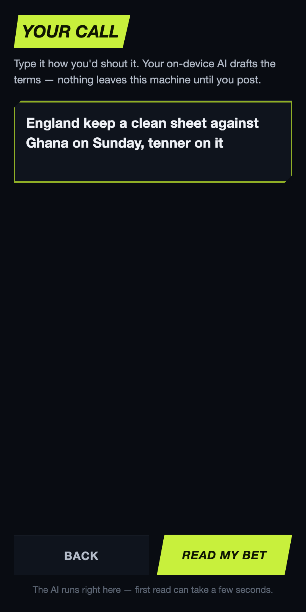
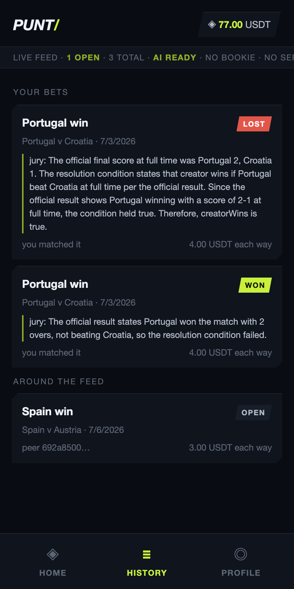
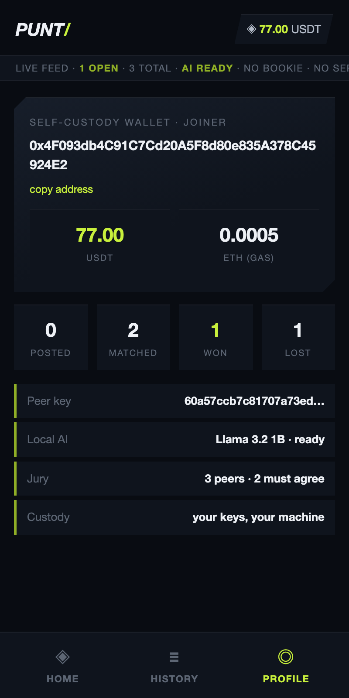

# Punt: swipe-to-stake football bets with no bookmaker

Post a football bet in plain English, let a friend swipe right to match your stake, and let a jury of on-device AI models pay the winner. No company hosts the market, resolves it, or takes a cut, because there is no server to host it on.

[](https://nodejs.org/)
[](https://soliditylang.org/)
[](LICENSE)
[](https://github.com/ajanaku1/punt/actions/workflows/ci.yml)
[](https://codecov.io/gh/ajanaku1/punt)



## Live Demo

**[https://punt-ten.vercel.app](https://punt-ten.vercel.app)**

Marketing site for the product. The app itself is a local Electron peer demo (see Running Locally).

## Screenshots

| Home | Composer | History | Profile |
|------|----------|---------|---------|
|  |  |  |  |

---

## What Is Punt?

Every prediction app is a platform: a company hosts the markets, settles them, and takes a cut. Punt is the version a platform cannot be. Bets replicate peer-to-peer over an Autobase feed, stakes sit in self-custodial WDK wallets escrowed on-chain, and settlement is decided by three peers each running a language model on their own machine. Built for the Tether Developers Cup on all three Tether stacks: Pears, QVAC, and WDK.

---

## Features

- **Plain-English bets, typed or spoken**: type "England keep a clean sheet against Ghana on Sunday, tenner on it", or tap the mic and say it. On-device Whisper transcribes, then a local LLM streams the resolvable terms into the composer as it writes them, flagging anything it had to guess.
- **Swipe to stake**: the home screen is a card stack of open bets from every peer. Swipe right to match the stake with real testnet USDT. Swipe left to pass.
- **Real peer discovery**: peers and jurors find each other on the Hyperswarm DHT from the feed's key. No server, no hardcoded address.
- **Encrypted feed**: every block is encrypted with a group secret. Knowing where the group meets is not enough to read the pots.
- **No bookmaker, no odds**: fixed-stake two-sided pots between friends. Winner takes the pot.
- **AI jury settlement**: three peers grade the bet independently against official football-data.org results, each with their own on-device model at temperature 0. Each verdict is signed by a self-custodial WDK account, and two matching signatures release the escrow.
- **Anti-spoofing feed**: the feed is a deterministic reducer. It drops junk before acknowledging a writer, and it accepts a bet only when its author key matches the peer that sent it.
- **Self-custody throughout**: every signature in Punt is WDK-native, both the stake movements and the jury verdicts. Ethers only encodes calldata and reads views. The escrow contract is the only thing that ever holds funds.

---

## Tech Stack

| Layer | Technology | Why it is load-bearing |
|-------|-----------|------------------------|
| Bet feed | Pears (Autobase + Corestore + Hyperswarm) | Peers discover on the DHT by the feed key and replicate an encrypted, optimistic multi-writer Autobase. The view is a deterministic reducer that binds each bet to its author, and only holders of the group secret can read it. Remove it and there is no app. |
| AI | QVAC (`@qvac/sdk`): Llama 3.2 1B parses, Whisper base.en transcribes, Qwen3 4B judges, all on-device | Speech-to-bet, bet parsing (streamed token by token into the UI), and every juror verdict run locally. No cloud AI anywhere. Prove it with `npm run jury:demo`. |
| Wallets | WDK (`@tetherto/wdk-wallet-evm`) | Every signature is WDK-native: stake custody (native `approve` + `sendTransaction`), escrow calls, and juror verdicts. Ethers only encodes calldata and reads chain state. |
| Escrow | Solidity 0.8 on Base Sepolia | Fixed-stake pots keyed by bet hash, released by 2-of-3 jury signatures. |
| Shell | Electron | Phone-shaped desktop window. All P2P and AI work runs in a separate Node daemon. |

---

## Testing the App

Reviewing this for the cup? [Judge in 5 minutes](docs/judge-in-5-minutes.md) is a reproducible path with pass/fail gates, most of it with no wallet or funds.

### Part 1: setup

1. Install Node 22+ and clone the repo.
2. Run `npm install --registry=https://registry.npmjs.org`.
3. Run `node scripts/fund-wallets.js`. It generates five wallets into a gitignored `.env` and prints their addresses.
4. Fund the CREATOR and JOINER addresses with a little Base Sepolia ETH ([faucet](https://www.alchemy.com/faucets/base-sepolia)). Jurors never need gas.
5. Run `node scripts/deploy.js`. It deploys the test USDT and the escrow, then mints 100 USDT to each player.
6. Get a free API key from [football-data.org](https://www.football-data.org/client/register) and add `FOOTBALL_DATA_KEY=<key>` to `.env`.

### Part 2: the journey

1. Run `npm run demo`. Two phone-shaped windows open (creator and joiner), and three juror processes start printing to the terminal.
2. On the creator phone, press `+` and type a bet on a recently finished real match, for example "Morocco beat Ecuador yesterday, 4 on it". The local model reads it back as structured terms. Press POST. Your stake locks in the escrow.
3. Watch the bet appear on the joiner phone's card stack. It arrived over P2P replication, not through any server.
4. Swipe right on the joiner phone. The joiner's stake locks. The pot now holds both stakes on-chain.
5. Watch the terminal. Each juror fetches the official result, grades the bet with its own local model, and prints its signed verdict.
6. The winner's daemon collects two matching signatures and settles. The winner's USDT balance rises by the whole pot.

### Part 3: spam defense

Run `node scripts/junk-check.js`. A peer appends two junk messages and one valid bet. The output shows only the valid bet ever reaches the feed.

---

## Smart Contracts

| Contract | Description |
|----------|-------------|
| `Escrow.sol` | One pot per bet, keyed by the bet's canonical hash. Creator stakes on create, one joiner counter-stakes, 2-of-3 juror signatures release the pot to the winner, timeout refunds both sides. |
| `MockUSDT.sol` | Six-decimal test USDT with an open faucet mint. Test token on a testnet, no value. |

Both are deployed on Base Sepolia. Addresses are written to `.env` by the deploy script.

---

## How It Works

```
 creator phone                                joiner phone
 (Electron)                                   (Electron)
      |                                            |
 peer daemon A  <----- Autobase feed ----->  peer daemon B
 (feed+WDK+LLM)     optimistic replication   (feed+WDK+LLM)
      |                                            |
      |  create pot                       join pot |
      +-----------------+    +---------------------+
                        v    v
                   Escrow contract  (Base Sepolia)
                        ^    ^
                        |    |  settle (2-of-3 signatures)
      +--------+   +--------+   +--------+
      | juror1 |   | juror2 |   | juror3 |     each: own Corestore,
      +--------+   +--------+   +--------+     own local LLM, own key
           \            |            /
            +--- football-data.org -+          official results feed
```

Peers find each other on the Hyperswarm DHT using the feed's discovery key, so there is no address to configure. A bet is appended optimistically to the shared Autobase. The apply function is a deterministic reducer: it validates the schema, checks that the bet's author key matches the sending peer, and only then acknowledges the writer, so junk and impersonation never converge. Verdicts travel over the same feed as messages signed by each juror's WDK account. The escrow verifies those signatures on-chain with `ecrecover`, so the contract itself is the final arbiter of who gets paid.

**Trust assumption**: settlement is honest-majority across the three jurors. Collusion resistance beyond that is out of scope for this prototype.

**Third-party services disclosed**: football-data.org (official match results) and a Base Sepolia RPC endpoint. Everything else, including all AI inference, runs on the peers' machines.

---

## Running Locally

```bash
git clone https://github.com/ajanaku1/punt.git && cd punt
npm install --registry=https://registry.npmjs.org
node scripts/fund-wallets.js       # generate wallets into .env
# fund CREATOR + JOINER with Base Sepolia ETH, then:
node scripts/deploy.js             # deploy USDT + escrow, mint test funds
npm test                           # 49 tests (escrow tests need foundry's anvil)
npm run demo                       # the full two-phone, three-juror demo
```

Proofs, each one command:

```bash
npm run jury:demo                  # real Qwen3 4B grades tricky fixtures on-device
npm run coverage                   # 49 tests with a coverage report
node scripts/p2p-check.js          # two-process replication proof
node scripts/junk-check.js         # spam rejection proof
node scripts/join-check.js         # WDK wallets fund a pot on-chain
npm run peer:creator               # one peer daemon, headless
npm run juror1                     # one juror, headless
```

---

## Project Structure

```
punt/
  contracts/            Escrow.sol + MockUSDT.sol
  packages/
    shared/             bet schema, parse prompts, verdict signing, WDK helpers
    feed/               the Autobase optimistic feed
    juror/              grading prompts, football-data client, juror daemon
    app/                peer daemon, Electron shell, swipe UI
  scripts/              fund-wallets, deploy, demo, compile, jury-demo, proofs
  tests/                49 node:test specs (schema, feed reducer + encryption, escrow, parse, verdicts, WDK signing, DHT wiring, multi-peer convergence)
  .github/workflows/    CI: contract compile, tests, coverage
  docs/images/          UI screenshots for the README
```

---

## License

MIT
